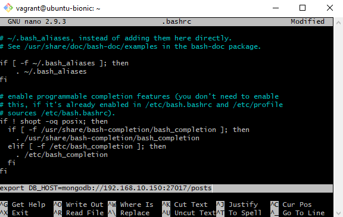

# Vagrant and provision files:

Set your vagrant file to have to the following ruby code : 
```ruby
# Configure 2 so that 2 virtual machines are created. and note we need a new do block.
Vagrant.configure("2") do |config|

  config.vm.define "app" do |app|
  # configures the VM settings
    app.vm.box = "ubuntu/bionic64"
    app.vm.network "private_network", ip:"192.168.10.100"

  # Syncs the "app" folder to the "/home/vagrant/app" location on the VM, changes on either will affect the other.
    app.vm.synced_folder "app", "/home/vagrant/app"
  
  # provision the VM to have Nginx installed
    app.vm.provision "shell", path: "provision.sh", privileged: false
  end

  config.vm.define "db" do |db|

    db.vm.box = "ubuntu/bionic64"
    db.vm.network "private_network", ip:"192.168.10.150"

    db.vm.synced_folder "environment", "/home/vagrant/environment"

  end

end

```
2. Set the provision file to have the following bash script : 
```bash   
#!/bin/bash

sudo apt-get update -y
sudo apt-get upgrade -y
sudo apt-get install nginx -y
sudo systemctl start nginx
sudo systemctl status nginx
sudo apt-get install python-software-properties -y
curl -sL https://deb.nodesource.com/setup_12.x | sudo -E bash -
sudo apt-get install nodejs -y
sudo npm install pm2 -g
#cd /home/vagrant/app
#npm install
#npm start


```
>Notice we commented out the last 3 commands as we want to be able to start the server when we are ready, not on startup.
3. Make sure the app and environment folders are within the same directory.
   
# Setting up the DB
1. Connect to the VM:

   ```bash
   vagrant ssh db
   ```

   Connects to a virtual machine named `db` using the Vagrant SSH command.

2. Update package lists:

   ```bash
   sudo apt-get update -y
   ```

   Updates the package lists for upgrades and installations.

3. Upgrade installed packages:

   ```bash
   sudo apt-get upgrade -y
   ```

   Upgrades the installed packages to the latest versions.

4. Add MongoDB GPG key:

   ```bash
   sudo apt-key adv --keyserver hkp://keyserver.ubuntu.com:80 --recv D68FA50FEA312927
   ```


   Adds the GPG key for MongoDB to the system.

5. Add MongoDB repository:

```bash
 echo "deb https://repo.mongodb.org/apt/ubuntu xenial/mongodb-org/3.2 multiverse" | sudo tee /etc/apt/sources.list.d/mongodb-org-3.2.list
```


   Adds the MongoDB repository to the package sources list.

6. Update package lists again:

   ```bash
   sudo apt-get update -y
   ```

   Updates the package lists again to include the MongoDB repository.

7. Upgrade MongoDB packages:

   ```bash
   sudo apt-get upgrade -y
   ```

   Upgrades the installed packages, including MongoDB, to the latest available versions.

8. Install MongoDB packages:

   ```bash
   sudo apt-get install -y mongodb-org=3.2.20 mongodb-org-server=3.2.20 mongodb-org-shell=3.2.20 mongodb-org-mongos=3.2.20 mongodb-org-tools=3.2.20
   ```

   Installs MongoDB and its associated packages at version 3.2.20.

9. Check MongoDB version:

   ```bash
   mongod --version
   ```

   Displays the version of the installed MongoDB.

10. Start MongoDB service:

    ```bash
    sudo systemctl start mongod
    ```

    Starts the MongoDB service.

11. Enable MongoDB service on startup:

    ```bash
    sudo systemctl enable mongod
    ```

    Enables the MongoDB service to start automatically when the system boots up.

12. Check MongoDB service status:

    ```bash
    sudo systemctl status mongod
    ```

    Checks the status of the MongoDB service.

13. Edit MongoDB configuration file:

    ```bash
    sudo nano /etc/mongod.conf
    ```

    Opens the MongoDB configuration file in the nano text editor for further configuration.


14. When you are in the config file, scroll down to where it says #network interfaces

and change **bindIP: 0.0.0.0** which will allow any ip address to access the mongodb server. Press CTRL+x > y > enter to save and exit
# Variables in linux

1. Set variables in Linux:

```bash
MY_VAR=hello
```

   Sets a variable named `MY_VAR` with the value "hello".

2. Print the value of a variable:

```bash
echo $MY_VAR
```

   Prints the value of the `MY_VAR` variable.

3. Set environment variable:

```bash
export MY_VAR1=hello
```

   Sets an environment variable named `MY_VAR1` with the value "hello".

4. Print the value of an environment variable:

```bash
printenv MY_VAR1
```

   Prints the value of the `MY_VAR1` environment variable.

5. Print all environment variables:

```bash
printenv
```

   Prints all the environment variables set in the current session.

# Setting up the App


1. Connect to the VM in a different bash:

```bash
   vagrant ssh app
```

   Connects to a virtual machine named `db` using the Vagrant SSH command.

2. Edit the `.bashrc` file:

```bash
sudo nano .bashrc
```

   Opens the `.bashrc` file in the nano text editor for editing.

3. Scroll to the bottom of the file and paste the following code : 
```bash
export DB_HOST=mongodb://192.168.10.150:27017/posts
```


4. Source the `.bashrc` file:

```bash
source .bashrc
```

   Loads the updated environment variables from the `.bashrc` file into the current shell session.

5. Change directory to the `app` folder:

```bash
cd app
```

   Navigates to the `app` directory.

6. Install dependencies using npm:

```bash
sudo npm install
```

   Installs the necessary dependencies for the application using npm.

7. Run the seed script (if necessary):

```bash
node seeds/seed.js
```

   Executes the `seed.js` script to seed the application with initial data (if automatic seeding doesn't occur).

8. Start the application using npm:

```bash
npm start
```

   Starts the application using the `npm start` command.

9. Start the application using node:

```bash
node app.js
```

   Alternatively, starts the application directly using the `node` command.

# Automating server initialization

1. create a  and populate with following bash code(same steps we took before):
```bash
#!/bin/bash
sudo apt-get update -y
sudo apt-get upgrade -y
sudo apt-key adv --keyserver hkp://keyserver.ubuntu.com:80 --recv D68FA50FEA312927
echo "deb https://repo.mongodb.org/apt/ubuntu xenial/mongodb-org/3.2 multiverse" | sudo tee /etc/apt/sources.list.d/mongodb-org-3.2.list
sudo apt-get update -y
sudo apt-get upgrade -y
sudo apt-get install -y mongodb-org=3.2.20 mongodb-org-server=3.2.20 mongodb-org-shell=3.2.20 mongodb-org-mongos=3.2.20 mongodb-org-tools=3.2.20
sudo systemctl start mongod
sudo systemctl enable mongod
```
After this all you have to do is follow from step 13 in the db setup process.

2. Add the following line to your vagrantfile:

```bash
# # Configure 2 so that 2 virtual machines are created. and note we need a new do block.
# Vagrant.configure("2") do |config|

#   config.vm.define "app" do |app|
#   # configures the VM settings
#     app.vm.box = "ubuntu/bionic64"
#     app.vm.network "private_network", ip:"192.168.10.100"

#   # Syncs the "app" folder to the "/home/vagrant/app" location on the VM, changes on either will affect the other.
#     app.vm.synced_folder "app", "/home/vagrant/app"
  
#   # provision the VM to have Nginx installed
#     app.vm.provision "shell", path: "provision.sh", privileged: false
#   end

#   config.vm.define "db" do |db|

#     db.vm.box = "ubuntu/bionic64"
#     db.vm.network "private_network", ip:"192.168.10.150"

#     db.vm.synced_folder "environment", "/home/vagrant/environment"

    db.vm.provision "shell", path: "dbprov.sh", privileged: false

#   end

# end

```
Check which app is running on (port 3000) to kill if its interfering
```bash
sudo lsof -i :3000
```