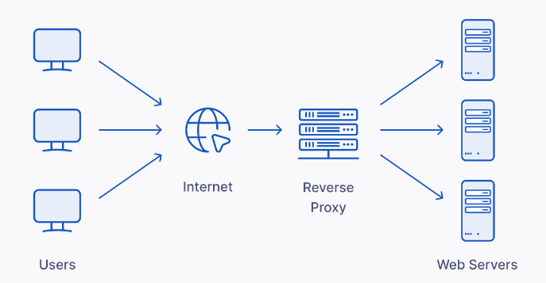

# Reverse Proxies

A reverse proxy is a server that acts as an intermediary between client devices and web servers. It enhances security, improves performance, and provides additional functionalities.

## Difference between a Proxy and a Reverse Proxy

While both proxies and reverse proxies serve as intermediaries between clients and servers, they operate in different directions.

- A forward proxy (proxy) sits between client devices and the internet, handling client requests and forwarding them to external servers.
- A reverse proxy is positioned between the internet and web servers, receiving client requests and forwarding them to the appropriate server.

Here's a simple diagram to illustrate the concept of a reverse proxy:



## Nginx's Default Configuration

Nginx's default configuration is typically located in the `sites-available` directory. This directory contains individual configuration files for each site or application hosted by Nginx. The specific location may vary, but it is commonly found at `/etc/nginx/sites-available` on Linux systems.

## Setting up an Nginx Reverse Proxy

To set up an Nginx reverse proxy, follow these steps:

1. Install Nginx.
2. Configure Nginx by editing the existing configuration file in the `sites-available` directory:
```bash
sudo nano /etc/nginx/sites-available/default
```

3. Edit the configuration file and define the reverse proxy settings under the location:

```bash
. . .
    location / {
        proxy_pass http://localhost:3000;
        proxy_http_version 1.1;
        proxy_set_header Upgrade $http_upgrade;
        proxy_set_header Connection 'upgrade';
        proxy_set_header Host $host;
        proxy_cache_bypass $http_upgrade;
    }

    location /posts {
        proxy_pass http://localhost:3000;
        proxy_http_version 1.1;
        proxy_set_header Upgrade $http_upgrade;
        proxy_set_header Connection 'upgrade';
        proxy_set_header Host $host;
        proxy_cache_bypass $http_upgrade;
    }


```

4. Restart Nginx to apply the changes:
```bash
sudo systemctl restart nginx
```

These steps should successfully set up an Nginx reverse proxy.
